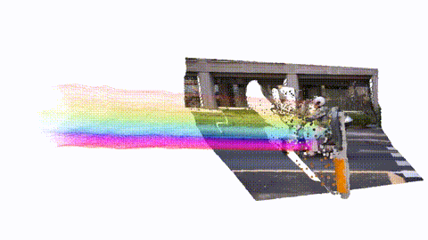
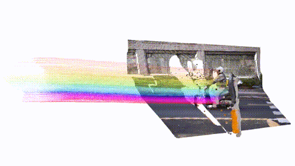
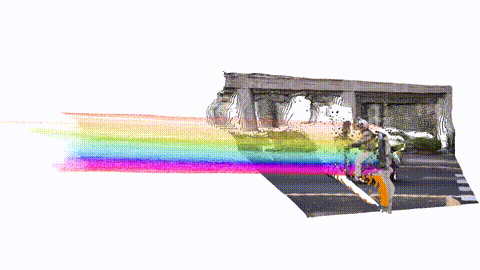
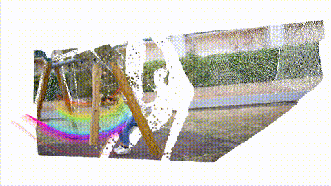
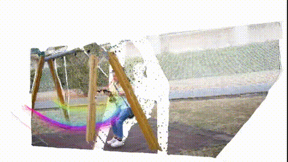
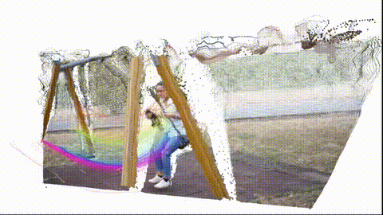
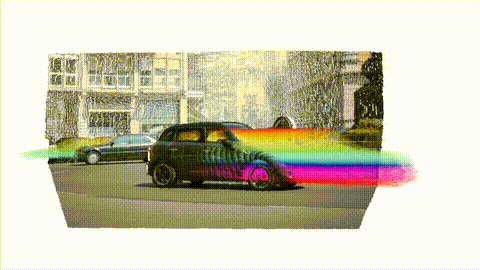
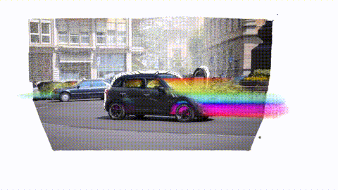
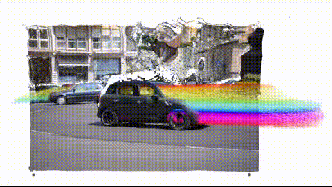

<div align="center">
<div style="text-align: center;">
    
    <h2>SM4RT: Learning Structured Motion Geometry for 4D Reconstruction</h2>
</div>

<div>
    <a href='https://shjlin.github.io/'  target='_blank'>Shing Ho J. Lin*</a>&emsp;
    <a href='https://wzzheng.net/' target='_blank'>Wenzhao Zheng*<sup>,</sup>†</a>&emsp;
    <a href="https://scholar.google.com/citations?user=0OakHQ0AAAAJ&hl=en" target='_blank'>Dong Zhuo*</a>&emsp;
    <a href="https://ykiwu.github.io/" target='_blank'>Yuqi Wu</a>
    <br>
    <a href="https://scholar.google.com/citations?user=6a79aPwAAAAJ&hl=en" target='_blank'>Jie Zhou</a>&emsp;
    <a href="http://ivg.au.tsinghua.edu.cn/Jiwen_Lu/" target='_blank'>Jiwen Lu</a>&emsp;
    <br>
    <small>* Equal contribution &emsp; † Project Leader</small>
</div>
<div>
    Intelligent Vision Group, Tsinghua University&emsp; 
</div>

<div align="center">
    <h4>
        <a href="https://wzzheng.net/SM4RT" target="_blank">
            
        </a>
        <a href="http://arxiv.org/abs/2607.22534" target="_blank">
            
        </a>
        <!-- <a href="https://huggingface.co/shjlin/sm4rt/" target="_blank">
            
        </a> -->
        <a href="https://www.modelscope.cn/models/shjlin/sm4rt/" target="_blank">
            
        </a>
    </h4>
</div>

<strong>SM4RT decomposes scene motion into structured latent bases, enabling structured and parsimonious motion percetion.</strong>

<div style="width: 100%; text-align: center; margin:auto;">
    
</div>

---
</div>

## 🏠 Model Architecture

<div align="center">
    
    <p align="justify">
        Architecture of SM4RT.
    </p>
</div>

## 🎨 Visualizations
<table>
  <tr>
    <th>SM4RT (Ours)</th>
    <th>4RC</th>
    <th>V-DPM</th>
  </tr>
  <tr>
    <td></td>
    <td></td>
    <td></td>
  </tr>
  <tr>
    <td></td>
    <td></td>
    <td></td>
  </tr>
  <tr>
    <td></td>
    <td></td>
    <td></td>
  </tr>
</table>

## 🔥 News
- [2026/07/26] Inference code released!
- [2026/07/26] Training code released!
- [2026/07/29] Model checkpoint released!

## 🔧 Installation

1. Clone Repo
    ```bash
    git clone https://github.com/wzzheng/SM4RT
    cd SM4RT
    ```

2. Create Conda Environment
    ```bash
    conda create -n sm4rt python=3.10
    conda activate sm4rt
    ```

3. Install Python Dependencies
    ```bash
    # Minimal Dependencies
    pip install -r requirements.txt -i https://pypi.tuna.tsinghua.edu.cn/simple

    # Clustering Modules (Not needed for ordinary inference)
    pip install torch_geometric -i https://pypi.tuna.tsinghua.edu.cn/simple
    pip install pyg_lib torch_scatter torch_sparse torch_cluster -f https://data.pyg.org/whl/torch-2.5.0+cu124.html
    ```

## Inference

1. Choose a video to infer, the following will produce track file (to be used in 3D visualization) and gif image of rendered dynamic track. All outputs are stored in ./output/

    ```bash
    cd ./src
    python inference.py --input ../assets/videos/swing --ckpt ../sm4rt.pt
    ```

2. Visualize the dynamic evolution of motion using viser. Choose downsampling ratio 'ds' as 2 or 4 if the server's bandwidth is limited. Choose image 'rgb' as the corresponding reference frame of your previous inference. 

    ```bash
    cd ./src
    python visualize.py --rgb ../assets/videos/swing/00000.jpg --ds 2
    ```

## Training

Configure your training setting in './config', and run:

    nohup bash -c 'CUDA_VISIBLE_DEVICES=0,1,2,3 NCCL_DEBUG=TRACE TORCH_DISTRIBUTED_DEBUG=DETAIL HYDRA_FULL_ERROR=1 accelerate launch --num_processes 4 --multi_gpu --main_process_port 26901 ./train.py --config-name train' > ./output/EXPNAME.log 2>&1


## TODO

- [ ] Release evaluation code.


## Citation

   If you find our repo useful for your research, please consider citing our paper:

   ```bibtex
  @article{lin2026sm4rt,
      title     = {SM4RT: Learning Structured Motion Geometry for 4D Reconstruction},
      author    = {Lin, Shing Ho J. and Zheng, Wenzhao and Zhuo, Dong and Wu, Yuqi and Zhou, Jie and Lu, Jiwen},
      journal   = {arXiv preprint arXiv:2607.22534},
      year      = {2026}
  }
   ```

## Acknowledgments

Our work is built upon several marvellous works. Do check them out!

3D Geometry Foundation Models:

[DUSt3R](https://github.com/naver/dust3r),
[VGGT](https://github.com/facebookresearch/vggt),
[StreamVGGT](https://github.com/wzzheng/StreamVGGT), 
[Point3R](https://github.com/YkiWu/Point3R), 
[DA3](https://github.com/ByteDance-Seed/depth-anything-3), 

Motion Perception:

[DELTAv1&2](https://github.com/snap-research/DenseTrack3Dv2), 
[St4RTrack](https://github.com/HavenFeng/St4RTrack), 
[TraceAnything](https://github.com/ByteDance-Seed/TraceAnything), 
[Any4D](https://github.com/Any-4D/Any4D), 
[V-DPM](https://github.com/eldar/vdpm), 
[4RC](https://github.com/Luo-Yihang/4RC), 
[D4RT](https://d4rt-paper.github.io/), 
[OpenD4RT](https://github.com/Lijiaxin0111/Open-d4rt)


Structure of Motion Related and Operators of Use: 
  
[ShapeOfMotion](https://github.com/vye16/shape-of-motion/), 
[RAFT-3D](https://github.com/princeton-vl/RAFT-3D),
[SE3 operators](https://github.com/eigenvivek/pytorchse3/), 
[hdbscan](https://github.com/lifuguan/IGGT_official),

## 📫 Contact

If you have any questions, please feel free to reach us at `linch25@mails.tsinghua.edu.cn`.

## ❌ Errata

In Figure 7 of the preprint, the RGB image pair in the top-right sample was inadvertently swapped. While this does not affect the interpretation, we will correct it along with the next version.

## 📄 License

This project is licensed under the Creative Commons Attribution-NonCommercial 4.0 International Public License (CC BY-NC 4.0).

© 2026 IVG, Tsinghua. All rights reserved.

For the full license text, see the [LICENSE](./LICENSE) file or visit:  
https://creativecommons.org/licenses/by-nc/4.0/
